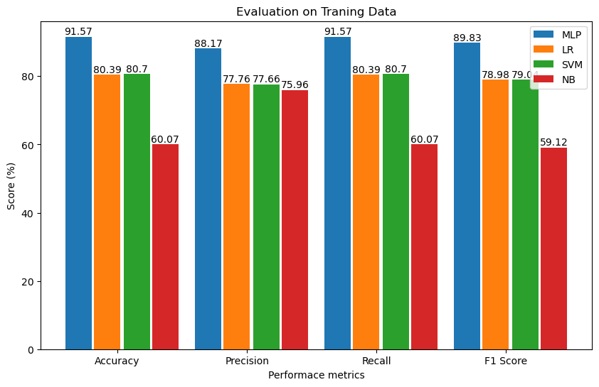
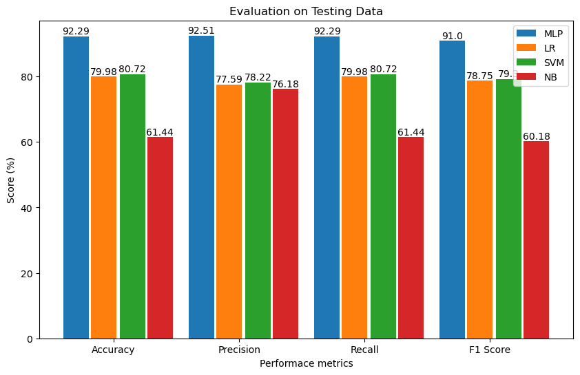

# Diabetes Prediction

Diabetes prediction is a technique for determining whether a patient has diabetes or not. Diabetes Mellitus can be caused by age, obesity, inactivity, inherited diabetes, lifestyle, poor food, high blood pressure, and other factors. Diabetes patients are at a significant risk of developing ailments such as heart disease, renal disease, stroke, vision problems, and nerve damage. 

The current procedure in hospitals is to collect the necessary information for diabetes diagnosis via various tests, and then give suitable therapy depending on the diagnosis. Nowadays, we can also generalize the patient status on disease with the help of AI like Machine Learning and Deep Learning. 

Here I used different machine learning algorithms for predicting and analysis of diabetes, like **Multilayer Perceptron, Logistic Regression, SVM, and naivey Bayes.**


## Prerequisite Library

There are some needed Libraries for this project to work. They are 

- numpy
- pandas
- sklearn
- matplotlib

> **Installation of numpy Library**
```bash
pip install numpy
```
> **Installation of pandas Library**
```bash
pip install pandas

```
> **Installation of scikit learn Library**
```bash
pip install -U scikit-learn
```
> **Installation of matplotlib Library**
```bash
pip install matplotlib
```
# Methodology


# Implementation
Following library are used for traing, testing and evaluating the overal projects:

```bash
## For data manupulation

panda
numpy

## For Visualization

matplotlib
seaborn
LabelEncoder 
train_test_split 
StandardScaler 
accuracy_score 
precision_score  
recall_score  
f1_score 
confusion_matrix 

## For Model traning and  Teting

MLPClassifier
LogisticRegression
SVC
GaussianNB

```

# Result and Analysis
Different results are obtained based on the performance metrics (accuracy, precision, recall, and F1 score).  The results of training and testing with various machine learning algorithms are displayed in the bar graph below.




# Conclusion 
Among the several algorithms employed in this project.  Multi-Layer Perceptron (MLP) outperforms previous algorithms, achieving 91.57% and 92.29% accuracy in training and testing, respectively.

